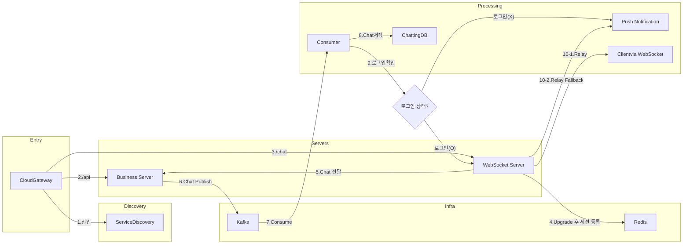

## FlowChart

```mermaid
flowchart LR
    %% 컴포넌트 그룹 정의
    subgraph Entry
        CG[CloudGateway]
    end

    subgraph Discovery
        SD[ServiceDiscovery]
    end

    subgraph Servers
        WS[WebSocket Server]
        BL[Business Server]
    end

    subgraph Infra
        R[Redis]
        K[Kafka]
    end

    subgraph Processing
        C[Consumer]
        DB[ChattingDB]
        Push[Push Notification]
        Client[Clientvia WebSocket]
    end

    %% 흐름 정의
    CG --1.진입--> SD
    CG --2./api--> BL
    CG --3./chat--> WS

    WS --4.Upgrade 후 세션 등록--> R
    WS --5.Chat 전달-->BL

    BL --6.Chat Publish--> K
    K  --7.Consume--> C
    C  --8.Chat저장--> DB

    %% 로그인 여부 분기
    C  --9.로그인확인--> D{로그인 상태?}
    D  --로그인(O)--> WS
    D  --로그인(X)--> Push

    %% 최종 전파
    WS --10-1.Relay--> Client
    WS --10-2.Relay Fallback--> Push
```